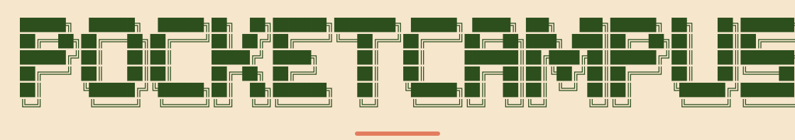

**Your money. Your campus.**

[Open the app](https://pocket-campus-bice.vercel.app/dashboard/) · [Install on Android or iPhone](https://pocket-campus-bice.vercel.app/install/)

Made with love for mobile users, both Android and iOS.

---

## Technology Stack

### Frontend

### Motion and State

### Backend

### Authentication and Location

### Deployment

---

## Overview

PocketCampus is a personal expense tracker built for students, packaged as a Progressive Web App so it installs and feels native on both Android and iOS without needing a separate app store listing. Every amount in the app is tracked in Pakistani Rupees, and the interface follows a warm, editorial design language rather than a generic dashboard look.

---

## Features

### Authentication

- Sign in with Google using Google Identity Services, no separate password to manage
- Session persistence so returning users land directly on their ledger
- Sign out from the profile page at any time

### Expense Tracking

- Add an expense in a single bottom sheet: description, amount in PKR, and category
- Seven expense categories: Food, Groceries, Books, Transport, Rent, Utilities, and Other
- Monthly ledger view with expenses grouped by day
- Month selector to move between past and current months
- Monthly summary header showing the total spent and number of expenses logged

### Monthly Budgets

- Set a personal budget for each month in Pakistani Rupees
- Automatically subtract saved expenses from the available balance
- Show an in-app alert when 50% or less of the budget remains
- Track overspending and keep balances synced across devices
- Calculate calendar months using Pakistan time

### Voice Expense Entry

- Tap **Listen** and say “Hey Pocket, I spent 500 rupees at inDrive”
- Prepare the amount, description, and suggested category for review
- Correct the details before tapping **Save Expense**
- Type a command when speech recognition is unavailable

Voice requires microphone permission and browser support. Listening works while the page is open, for up to 30 seconds; it does not run in the background. Speech recognition can make mistakes, so entries require review before saving.

### Activity

- A dedicated activity feed of recent expenses pulled live from the database
- A rolling seven day spending total alongside the running total
- Empty and error states so the screen never looks broken while data loads

### Profile

- Displays the signed in Google account, name, email, and profile picture
- Shows a monthly spending snapshot for the current calendar month
- Sign out action available directly from this screen

### Explore

- Live location detection using the device's Geolocation API
- Displays nearby bookshops and eating spots sourced from OpenStreetMap through the Overpass API
- Filterable results by place type
- Directions link out to maps for a selected location

### Mobile Experience

- Installable as a Progressive Web App on both Android and iOS home screens
- Standalone display mode so the app opens without browser chrome
- Safe area handling for devices with notches and home indicators
- Bottom tab navigation with a floating action button for quickly logging an expense

---

## Design System

PocketCampus uses a "Warm Craft" palette applied on a strict 60-30-10 basis.

| Role | Color | Hex |
|---|---|---|
| Background, dominant (60%) | Warm Beige | `#F5E6CC` |
| Headings, navigation (30%) | Forest Green | `#2D4F1E` |
| Buttons, active states (10%) | Terracotta | `#E27D60` |
| Body and metadata text | Slate Grey | `#4A4A4A` |

---

## Mobile App

**[Install PocketCampus](https://pocket-campus-bice.vercel.app/install/)** directly from the browser:

- **Android:** open the link in Chrome and select **Install PocketCampus**, or **⋮ → Add to Home screen → Install**.
- **iPhone / iPad:** open the link in Safari and select **Share → Add to Home Screen → Add**. Keep **Open as Web App** enabled if shown.

The installed web app opens from your Home Screen without a store listing or APK. New releases load when the app is reopened or reloaded; an already-open app shows an update notice. Google sign-in keeps your personal ledger and budgets linked to your account.

Internet is required to sign in and save expenses. Budget alerts appear inside the app. Browser speech services may process voice audio remotely.

See [DEPLOYMENT.md](DEPLOYMENT.md) for setup and deployment instructions.

---

## License and Usage Restrictions

This project is proprietary. It is not licensed under MIT, Apache, or any other open source license. No permission is granted to use, copy, modify, distribute, or deploy this codebase without prior written permission from the author. All rights are reserved.

